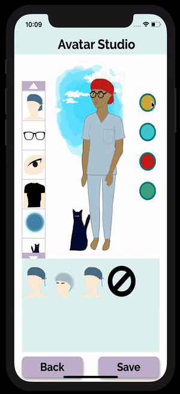
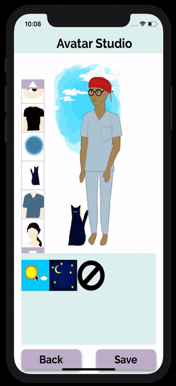

# AvatarComponents
This is a system for creating customisable avatars which I implemented into my uni capstone project, Earn Your Scrubs. Earn Your Scrubs is a mobile based
e-learning app designed to attract nursing students to the perioperative specialty, and customisable avatars is one of the methods used for
engaging users. While the artwork is still a work in progress, this provides a solid framework for future development.
\
\
This was created using React Native and the react-native-svg library. The AvatarBase component is rendered on a screen, and it renders a subcomponent for each item type (eg. head, hat, etc.) according to the current_outfit object received from the back end and stored in the redux state. The item model is simple, containing only id, type, and componentName fields. The appropriate item components are rendered by the item type component, based on the componentName field. Each item component contains a Path object from the react-native-svg library. This was created GIMP. Based on an item image, each section of colour was selected and converted to a path, which was then exported to an svg and then pasted into the item component. Colours are assigned using a local arrary for ease of editing, and some colours can be selected by the user, and are accessed from the redux state.
\
\
\
Some conditional rendering is also used to solve problems such as hats seeming to sit on top of hair, if both are rendered. As seen in the example on the left, the hair is only rendered when no hat is worn. If a hat is worn, the hair is not rendered.
\
\
\
Some animation is also included to add some life to the avatar. A custom hook, useInterval, was used to assign intervals between each animation update. Some animations, such as the eye blinking, were based on timing and conditional rendering. Other animations, such as the clouds and the stars, were based on manipulating the rotation and x/y transform values.
